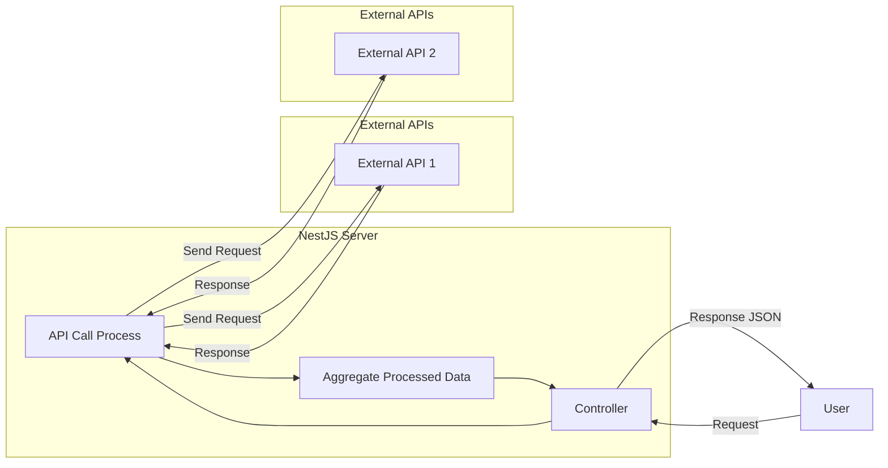

# Diagram

```mermaid

graph LR
    subgraph A[NestJS Server]
        G[API Call Process]
        H[Aggregate Processed Data]
        I[Controller]
    end
    
    subgraph Cloud2 [External APIs]
        B[External API 1]
    end

    subgraph Cloud3 [External APIs]
        C[External API 2]
    end

    J[User]
    
    J -->|Request| I
    I --> G
    G -->|Send Request| B
    G -->|Send Request| C
    B -->|Response| G
    C -->|Response| G
    G --> H
    H --> I
    I -->|Response JSON| J
```
